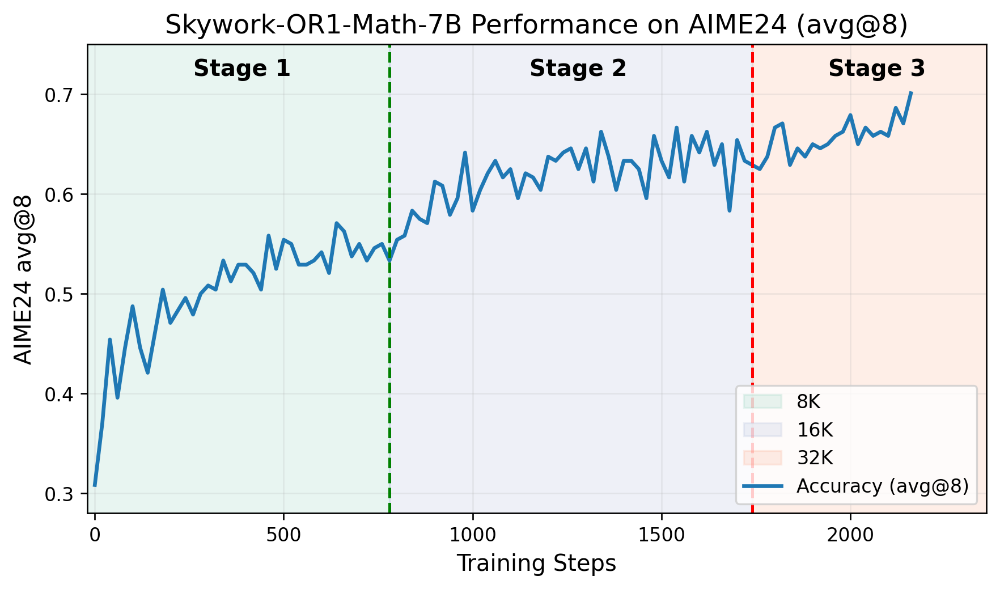
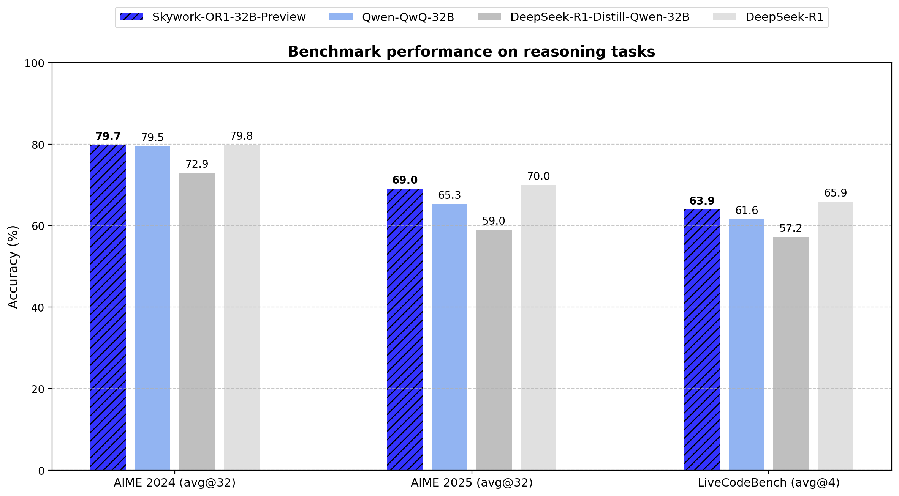
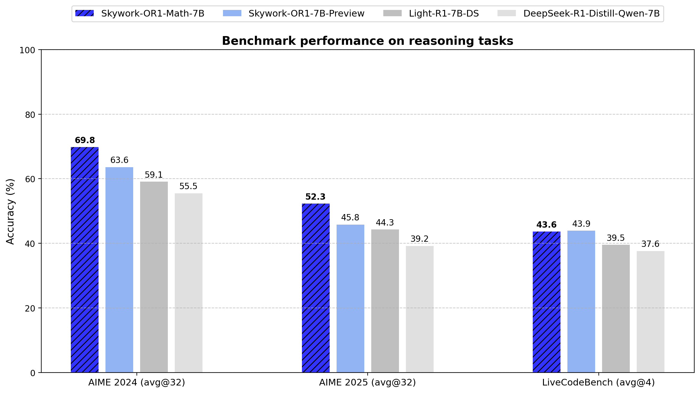

---
base_model:
- deepseek-ai/DeepSeek-R1-Distill-Qwen-7B
datasets:
- Skywork/Skywork-OR1-RL-Data
---
<div align="center">

# 🤔 Skywork-OR1 (Open Reasoner 1)

</div>
<div>
<br>

<div align="center">

[](https://huggingface.co/collections/Skywork/skywork-or1-67fa1bcb41b436ef2def76b9)
[](https://huggingface.co/datasets/Skywork/Skywork-OR1-RL-Data)
[](https://github.com/SkyworkAI/Skywork-OR1)
[](https://capricious-hydrogen-41c.notion.site/Skywork-Open-Reaonser-Series-1d0bc9ae823a80459b46c149e4f51680)

[](https://github.com/SkyworkAI/Skywork-OR1/stargazers)
[](https://github.com/SkyworkAI/Skywork-OR1/fork)

</div>

## 🔥 News

- **April 13, 2025**: We release the **`Skywork-OR1`** (Open Reasoner 1) series of models, including **`Skywork-OR1-Math-7B`**, **`Skywork-OR1-32B-Preview`**, and **`Skywork-OR1-7B-Preview`**. We open-source
  - 🤗 Model weights: [`Skywork-OR1-Math-7B`](https://huggingface.co/Skywork/Skywork-OR1-Math-7B),  [`Skywork-OR1-32B-Preview`](https://huggingface.co/Skywork/Skywork-OR1-32B-Preview), [`Skywork-OR1-7B-Preview`](https://huggingface.co/Skywork/Skywork-OR1-7B-Preview)
  - 🤗 Training data: [`Skywork-OR1-RL-Data`](https://huggingface.co/datasets/Skywork/Skywork-OR1-RL-Data)
  - 🧑‍💻 Code: [`Skywork-OR1`](https://github.com/SkyworkAI/Skywork-OR1)
  - We also release a [Notion Blog](https://capricious-hydrogen-41c.notion.site/Skywork-Open-Reaonser-Series-1d0bc9ae823a80459b46c149e4f51680) to share detailed training recipes and extensive experimental results, analysis, and insights, dedicated to helping the community to better research, understand, and push the frontier of open reasoning models.

## 📖 Overview

<div align="center">


<sub>The AIME24 scores versus training steps of Skywork-OR1-Math-7B in our multi-stage training pipeline.</sub>
</div>

The **`Skywork-OR1`** (Open Reasoner 1) model series consists of powerful math and code reasoning models trained using large-scale rule-based reinforcement learning with carefully designed datasets and training recipes. This series includes two general-purpose reasoning modelsl, **`Skywork-OR1-7B-Preview`** and **`Skywork-OR1-32B-Preview`**, along with a math-specialized model, **`Skywork-OR1-Math-7B`**.

- **[`Skywork-OR1-Math-7B`](https://huggingface.co/Skywork/Skywork-OR1-Math-7B)** is specifically optimized for mathematical reasoning, scoring **69.8** on AIME24 and **52.3** on AIME25 — well ahead of all models of similar size.
- **[`Skywork-OR1-32B-Preview`](https://huggingface.co/Skywork/Skywork-OR1-32B-Preview)** delivers the 671B-parameter Deepseek-R1 performance on math tasks (AIME24 and AIME25) and coding tasks (LiveCodeBench).
- **[`Skywork-OR1-7B-Preview`](https://huggingface.co/Skywork/Skywork-OR1-7B-Preview)** outperforms all similarly sized models in both math and coding scenarios.

The final release version will be available in two weeks.

## 📊 Evaluation

<div align="center">


</div>
</div>

We evaluate our models on AIME24, AIME25, and LiveCodeBench. Instead of using Pass@1, which is common in prior work, we introduce Avg@K as the primary metric. This metric robustly measures a model's average performance across K independent attempts, reducing the impact of randomness and enhancing the reliability of the results. We believe that Avg@K provides a better reflection of a model's stability and reasoning consistency.

We include the detailed results in the following table.

| Model | AIME24 (Avg@32) | AIME25 (Avg@32) | LiveCodeBench (8/1/24-2/1/25) (Avg@4) |
|-------|---------|---------|--------------|
| DeepSeek-R1-Distill-Qwen-7B | 55.5 | 39.2| 37.6 |
| Light-R1-7B-DS | 59.1 | 44.3| 39.5 |
| DeepSeek-R1-Distill-Qwen-32B | 72.9 | 59.0| 57.2 |
| TinyR1-32B-Preview | 78.1| 65.3| 61.6 |
| QwQ-32B | 79.5 | 65.3| 61.6 |
| DeepSeek-R1 | 79.8 | 70.0| 65.9 |
| **Skywork-OR1-Math-7B** | 69.8 | 52.3 | 43.6 |
| **Skywork-OR1-7B-Preview** | 63.6 | 45.8 | 43.9 |
| **Skywork-OR1-32B-Preview** | 79.7 | 69.0 | 63.9 |

## ⚙️ Training Recipe

We offer a brief overview of our data and training pipeline below. For more details, please refer to our Notion Blog [here](https://capricious-hydrogen-41c.notion.site/Skywork-Open-Reaonser-Series-1d0bc9ae823a80459b46c149e4f51680).

### Data

- We select, clean, and curate **a dataset of 110K verifiable, challenging, and diverse math problems and 14K coding questions** from open-source datasets.
- We perform **model-aware difficulty estimation** for each problem and model and conduct **rigorous quality assessment prior to training** to ensure training efficiency and effectiveness.

### Training

We develop a customized version of GRPO that leverages both data-wise and training-wise improvements:

- We perform both **offline and online difficulty-based filtering** and **rejection sampling** to improve training efficiency.
- We incorporate a **multi-stage training pipeline** coupled with **adaptive entropy control** and other techniques to enhance exploration and stability.

## 📄 Technical Report

Our technical report will be released soon. Stay tuned!

## 🙏 Acknowledgements

- Both of our models are trained on top of [`DeepSeek-R1-Distill-Qwen-7B`](https://huggingface.co/deepseek-ai/DeepSeek-R1-Distill-Qwen-7B) and [`DeepSeek-R1-Distill-Qwen-32B`](https://huggingface.co/deepseek-ai/DeepSeek-R1-Distill-Qwen-32B).
- Both models are trained using [a custom fork](https://github.com/SkyworkAI/Skywork-OR1) of the wonderful [`verl`](https://github.com/volcengine/verl) project.

## 📚 Citation

Please cite the following:

```bibtex
@article{he2025skywork,
  title={Skywork Open Reasoner 1 Technical Report},
  author={He, Jujie and Liu, Jiacai and Liu, Chris Yuhao and Yan, Rui and Wang, Chaojie and Cheng, Peng and Zhang, Xiaoyu and Zhang, Fuxiang and Xu, Jiacheng and Shen, Wei and Li, Siyuan and Zeng, Liang and Wei, Tianwen and Cheng, Cheng and An, Bo and Liu, Yang and Zhou, Yahui},
  journal={arXiv preprint arXiv:2505.22312},
  year={2025}
}

@misc{skywork-or1-2025,
  title={Skywork Open Reasoner Series},
  author = {He, Jujie and Liu, Jiacai and Liu, Chris Yuhao and Yan, Rui and Wang, Chaojie and Cheng, Peng and Zhang, Xiaoyu and Zhang, Fuxiang and Xu, Jiacheng and Shen, Wei and Li, Siyuan and Zeng, Liang and Wei, Tianwen and Cheng, Cheng and Liu, Yang and Zhou, Yahui},
  howpublished={\url{https://capricious-hydrogen-41c.notion.site/Skywork-Open-Reaonser-Series-1d0bc9ae823a80459b46c149e4f51680}},
  note={Notion Blog},
  year={2025}
}
```